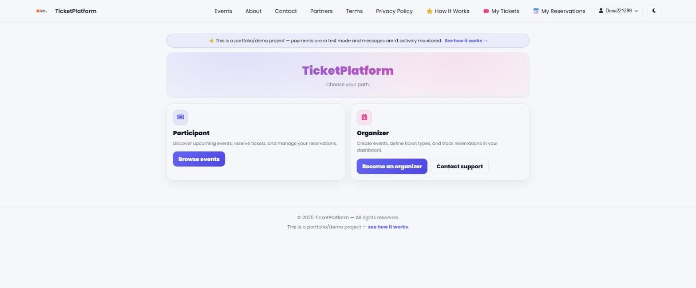
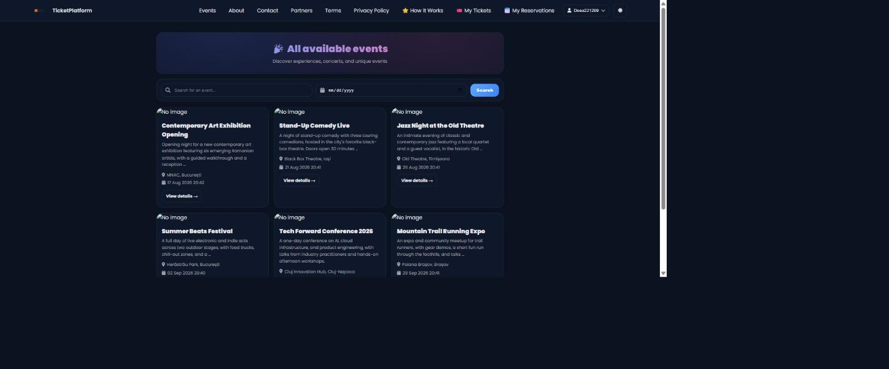
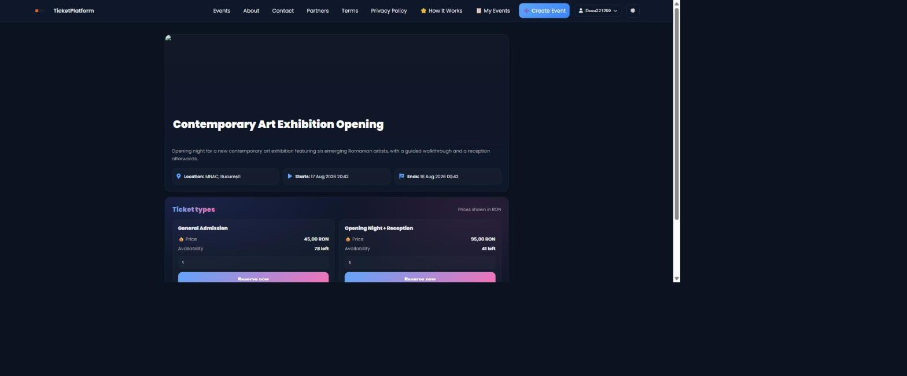
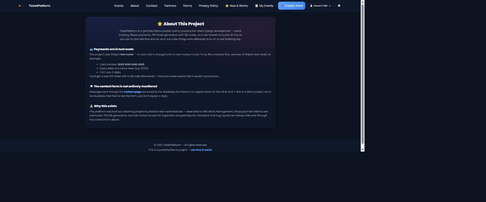

# 🎟️ TicketPlatform

A modern event ticketing system designed to replace chaotic booking processes with structured, scalable digital workflows.

🔗 **Live demo:** [platform-tickets.onrender.com](https://platform-tickets.onrender.com/) — see [How It Works](https://platform-tickets.onrender.com/how-it-works/) before you try checkout (Stripe test mode, no real charges).

---

## 📸 Screenshots

| Home | Events list |
|---|---|
|  |  |

| Event details & checkout | About this project |
|---|---|
|  |  |

---

## ❗ The Problem

Most event booking processes are still messy and inefficient:

- 📱 Reservations happen through messages, calls, or spreadsheets
- ❌ No real-time availability tracking
- 🔁 Manual confirmations and constant back-and-forth
- 🎫 No secure or reliable ticket validation
- ⚠️ High risk of overbooking or lost data

For organizers, this means wasted time, stress, and lack of control.
For users, it creates friction and uncertainty.

---

## 💡 The Solution

TicketPlatform transforms this chaos into a clean, automated system:

- Users can reserve tickets instantly and pay securely through Stripe
- Organizers manage everything from one place
- Each ticket has a unique QR code that's actually scanned and checked off at entry — not just generated and forgotten
- Availability is tracked in real-time, with automatic release of unpaid holds
- The entire flow becomes structured and reliable

---

## ✨ Core Features

**Booking & payments**
- 🎟️ Multi-ticket system per event, with real-time stock tracking and a visual urgency indicator as tickets run low
- 💳 Stripe Checkout — payment intents, webhooks, and server-side confirmation
- ⏳ Automatic release of ticket stock held by unpaid reservations, with a live countdown on the hold

**At the door**
- 📄 Automatic PDF ticket generation with a QR code, plus an in-browser "Show my ticket" QR reveal — no download required
- ✅ Organizer check-in flow: scan the QR (or type the code manually) to mark a ticket used, with reuse blocked automatically

**For organizers**
- 📅 Event creation, editing, and branding (banner + theme color)
- 📊 Organizer dashboard with occupancy, revenue stats, and per-reservation check-in status
- 🔐 Role-based accounts (participant / organizer), password reset, login rate limiting shared across all app workers

**Trust & polish**
- 🔥 Social proof ("N people attending") and a live countdown to the event on the event page
- 🌗 Full dark mode, including the checkout and payment confirmation screens
- 💬 Contact/support form with reCAPTCHA and per-visitor conversation threads

---

## 🧱 Tech Stack

- **Backend:** Django 6, PostgreSQL (production) / SQLite (local)
- **Payments:** Stripe (Payment Intents + webhooks)
- **PDF / QR:** ReportLab, qrcode
- **Spam protection:** django-recaptcha
- **Static files:** WhiteNoise
- **Hosting:** Render

---

## 🚀 Running it locally

```bash
git clone https://github.com/SanduAndreea22/platform_tickets.git
cd platform_tickets

python -m venv env
env\Scripts\activate        # or source env/bin/activate on macOS/Linux
pip install -r requirements.txt

# copy .env.example to .env and fill in SECRET_KEY / STRIPE_* keys
python manage.py migrate
python manage.py runserver
```

Want some sample events to look at instead of an empty homepage?

```bash
python manage.py seed_demo_data
```

---

## 🎯 What This Project Represents

This project is not just a demo. It represents the ability to:

- Build production-ready systems with real payment processing
- Structure real business workflows (inventory, reservations, role-based access, entry validation)
- Design clean, scalable backend architecture
- Deliver a complete, deployed end-to-end solution — not just a local prototype

---

## 🔮 Future Development

- Email ticket delivery
- Deeper analytics (trends over time, exportable reports — beyond the current per-event stats)
- Multi-language support

---

## 👩‍💻 Author

**Andreea Sandu**
Custom Business Systems Developer | Django & Python
